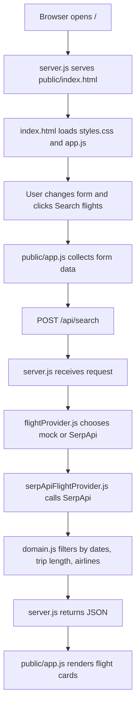
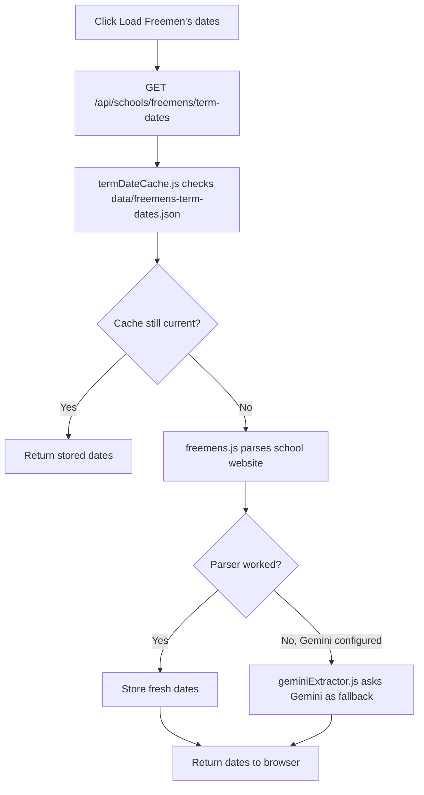

# Learning Guide: How This Project Works

This guide explains the Family Flight Finder project from a beginner web-development point of view. It is written for someone who has some basic HTML knowledge, but is still new to JavaScript, backend servers, APIs, Docker, and deployment.

The project is a good learning example because it has the same broad shape as many real web apps:

- a browser page
- HTML for structure
- CSS for styling
- browser JavaScript for interaction
- a backend server
- API routes
- external services
- stored data
- Docker deployment
- automated tests

## 1. Project Map

The project folder is:

```text
SchoolHolidayFlightSearcher/
```

The main files and folders are:

```text
SchoolHolidayFlightSearcher/
├─ public/
│  ├─ index.html        # The page structure: buttons, inputs, panels
│  ├─ styles.css        # The visual design: layout, colours, spacing, fonts
│  └─ app.js            # Browser-side behaviour: clicks, form reading, API calls
│
├─ server.js            # Backend entry point: starts the Node web server
├─ package.json         # Project metadata and commands: npm start, npm test
│
├─ src/
│  ├─ domain.js         # Core search rules: dates, trip length, airline filtering
│  ├─ airports.js       # Static airport list and route presets
│  ├─ airlines.js       # Static airline groups
│  ├─ env.js            # Loads .env secrets/settings
│  │
│  ├─ providers/
│  │  ├─ flightProvider.js          # Chooses mock or SerpApi provider
│  │  ├─ mockFlightProvider.js      # Fake data for testing without API cost
│  │  ├─ serpApiFlightProvider.js   # Real flight search through SerpApi
│  │  └─ geminiExtractor.js         # Optional Gemini fallback for term-date parsing
│  │
│  └─ schools/
│     ├─ freemens.js          # Parses Freemen's school term dates
│     └─ termDateCache.js     # Stores/refreshes cached term dates
│
├─ data/
│  └─ freemens-term-dates.json # Stored school date cache
│
├─ test/                 # Automated tests
├─ Dockerfile            # How to package the app into a container
├─ docker-compose.yml    # How to run it on your server
└─ docs/
   ├─ UNRAID_DEPLOYMENT.md
   └─ LEARNING_GUIDE.md
```

## 2. Entry Point

The backend entry point is:

```text
server.js
```

When you run:

```bash
npm start
```

it runs:

```bash
node server.js
```

That starts the backend server.

The browser then opens:

```text
public/index.html
```

That HTML file loads:

```html
<link rel="stylesheet" href="styles.css">
<script src="app.js"></script>
```

So there are two important entry points:

```text
server.js          backend/server entry point
public/index.html browser/page entry point
```

## 3. Basic App Flow

When you open the app in the browser:



In plain English:

1. The server sends the web page to the browser.
2. The browser shows the page.
3. JavaScript in `public/app.js` waits for button clicks.
4. When you search, the browser sends your search request to the backend.
5. The backend calls SerpApi or the mock provider.
6. The backend filters and sorts the results.
7. The browser receives the results and updates the page.

## 4. Term-Date Flow

Term dates work slightly differently because the app stores a cached copy.



Important point:

The app does not normally use AI to load term dates.

Normally it does this:

1. Read stored dates from `data/freemens-term-dates.json`.
2. If they are getting too close to expiry, fetch the Freemen's page.
3. Parse the page with normal JavaScript logic.
4. Store the fresh result.

Gemini is only a fallback if the normal parser cannot extract enough dates.

## 5. What Each Technology Does

### HTML

HTML is the structure of the page.

In this project:

```text
public/index.html
```

HTML defines what exists on the page:

- route inputs
- buttons
- dropdowns
- child cards
- result panels
- headings

Example:

```html
<input name="origin" value="LON" list="airport-options" autocomplete="off" required>
```

That means:

```text
There is an input box called origin.
```

HTML does not do much logic by itself. It is the skeleton of the page.

### CSS

CSS is the presentation layer.

In this project:

```text
public/styles.css
```

CSS controls:

- layout
- colours
- spacing
- fonts
- borders
- button appearance
- mobile behaviour

Example:

```css
.configuration-column {
  display: grid;
  grid-template-columns: minmax(320px, 0.95fr) minmax(440px, 1.25fr);
  gap: 12px;
}
```

That means:

```text
Place the main controls into two columns.
```

CSS is what turns plain HTML into a usable interface.

### Browser JavaScript

Browser JavaScript runs inside the user's browser.

In this project:

```text
public/app.js
```

It handles behaviour such as:

- reading form values
- responding to clicks
- loading airport and airline lists
- calling backend APIs
- updating the page with search results

Example:

```js
fetch(`${apiBase}/search`, {
  method: "POST",
  headers: { "content-type": "application/json" },
  body: JSON.stringify(collectRequest())
});
```

That means:

```text
Send the search form data to the backend.
```

This is the part that makes the page interactive.

### Node.js

Node.js is JavaScript running outside the browser.

In this project:

```text
server.js
```

The backend server can:

- read files
- store cached data
- call external APIs
- use secret API keys
- return JSON to the browser

This separation is important.

Anything in `public/` can be seen by the browser user. So API keys should not go there.

Private keys belong on the backend, loaded from `.env`, then used by files such as:

```text
src/providers/serpApiFlightProvider.js
src/providers/geminiExtractor.js
```

### API Routes

The backend exposes small URLs that the browser JavaScript can call.

In `server.js`, the main routes are:

```text
GET  /api/health
GET  /api/airports
GET  /api/airlines
GET  /api/schools/freemens/term-dates
POST /api/schools/freemens/term-dates/refresh
POST /api/search
```

For example:

```text
GET /api/airports
```

returns a list of airport codes and route presets.

```text
POST /api/search
```

accepts a flight-search request and returns matching itineraries.

### SerpApi

SerpApi is used for real flight-search data.

In this project:

```text
src/providers/serpApiFlightProvider.js
```

This file sends requests to SerpApi's Google Flights API and converts the response into the app's internal itinerary format.

The app uses environment variables such as:

```text
SERPAPI_API_KEY
SERPAPI_CURRENCY
SERPAPI_MAX_DATE_PAIRS
SERPAPI_RESULTS_PER_PAIR
```

These are configured through `.env` and `docker-compose.yml`.

### Gemini / LLM

Gemini is an optional fallback for school term-date extraction.

In this project:

```text
src/providers/geminiExtractor.js
```

It is not used for normal flight search.

It is only used when:

1. the app fetches the Freemen's term-date page
2. the deterministic parser cannot extract enough useful dates
3. `GEMINI_API_KEY` is configured

So the normal path is not AI-based.

The LLM path is a backup helper.

### Docker

Docker packages the app so it can run consistently on your Unraid server.

The important files are:

```text
Dockerfile
docker-compose.yml
```

`Dockerfile` describes how to build the app image.

`docker-compose.yml` describes how to run the app container:

- which port to expose
- which environment variables to use
- which local folder to mount for stored data

This line is important:

```yaml
ports:
  - "3010:3000"
```

It means:

```text
Unraid/server port 3010 -> app container port 3000
```

So you can access the app at:

```text
http://YOUR-SERVER-IP:3010/
```

This part is also important:

```yaml
volumes:
  - ./data:/app/data
```

It means:

```text
Keep stored term dates outside the container so they survive rebuilds.
```

### Tests

The `test/` folder contains automated checks.

Run them with:

```bash
npm test
```

Tests are useful because they check the important logic without you having to click around manually every time.

Examples:

- date-window calculation
- airline filtering
- airport data
- SerpApi result parsing
- term-date cache refresh

## 6. A Good Reading Order For This Project

If you want to learn from this project, read it in this order.

### Step 1: Page Structure

Read:

```text
public/index.html
```

Try to match each visible part of the page to the HTML:

- Route
- Children & School Dates
- Flexibility Settings
- Search button
- Shared Window
- Recommended Flights

### Step 2: Styling

Read:

```text
public/styles.css
```

Start with these selectors:

```text
.app-shell
.hero
.configuration-column
.left-stack
.right-stack
.panel
.field-grid
.results-layout
.result-card
```

Do not try to understand every line at first. Focus on how layout is created.

### Step 3: Browser Behaviour

Read:

```text
public/app.js
```

Focus on:

```text
document.querySelector(...)
addEventListener(...)
collectRequest()
fetch(...)
renderResults(...)
renderWindow(...)
```

This file is where the page becomes interactive.

### Step 4: Backend Routes

Read:

```text
server.js
```

Look for:

```text
/api/health
/api/airports
/api/airlines
/api/search
```

This teaches you how the browser talks to the server.

### Step 5: Business Logic

Read:

```text
src/domain.js
```

This is the heart of the app's rules:

- calculate the travel window
- check trip length
- filter by airline
- sort results

This is a useful file to study because it is mostly normal JavaScript logic, not browser-specific and not server-specific.

### Step 6: Providers

Start with:

```text
src/providers/mockFlightProvider.js
```

Then move to:

```text
src/providers/serpApiFlightProvider.js
```

The mock provider is easier to understand because it creates fake flights locally.

The SerpApi provider is more realistic because it calls an external service.

## 7. Common Beginner Concepts In This Project

### Client vs Server

Client means the browser.

Server means Node.js running on your Mac or Unraid server.

In this project:

```text
Client:
public/index.html
public/styles.css
public/app.js

Server:
server.js
src/
```

### Static Files

Static files are sent directly to the browser.

In this project:

```text
public/index.html
public/styles.css
public/app.js
```

They are called static because the server mostly just sends them as files.

### JSON

JSON is a data format used for browser/server communication.

Example:

```json
{
  "origin": "LHR",
  "destination": "CAN",
  "adults": 2
}
```

The browser sends JSON to the backend.

The backend returns JSON to the browser.

### Environment Variables

Environment variables are settings passed into the app without hard-coding them.

Examples:

```text
FLIGHT_PROVIDER=serpapi
SERPAPI_API_KEY=your-key
GEMINI_API_KEY=your-key
TERM_CACHE_REFRESH_DAYS=183
```

They are useful for:

- secrets
- deployment settings
- provider choice
- tuning API usage

### Cache

A cache is stored data reused later to avoid doing work again.

In this project:

```text
data/freemens-term-dates.json
```

stores Freemen's term dates so the app does not need to fetch and parse the school website every time.

## 8. Free Online References

### General Web Development

- [MDN Learn Web Development](https://developer.mozilla.org/en-US/docs/Learn)
- [MDN Web Developer Guides](https://developer.mozilla.org/en-US/docs/MDN/Guides)

### HTML

- [MDN HTML learning area](https://developer.mozilla.org/en-US/docs/Learn/HTML)

### CSS

- [MDN CSS learning area](https://developer.mozilla.org/en-US/docs/Learn/CSS)

### JavaScript

- [MDN JavaScript learning area](https://developer.mozilla.org/en-US/docs/Learn/JavaScript)

### Fetch and APIs

- [MDN Using Fetch](https://developer.mozilla.org/en-US/docs/Web/API/Fetch_API/Using_Fetch)
- [MDN Fetch API reference](https://developer.mozilla.org/en-US/docs/Web/API/Fetch_API)

### Node.js

- [Node.js official introduction](https://nodejs.org/en/learn)
- [How much JavaScript you need for Node.js](https://nodejs.org/en/learn/getting-started/how-much-javascript-do-you-need-to-know-to-use-nodejs)

### Docker

- [Docker Compose quickstart](https://docs.docker.com/compose/gettingstarted/)

### SerpApi

- [SerpApi Google Flights API](https://serpapi.com/google-flights-api)

### Gemini API

- [Gemini API text generation docs](https://ai.google.dev/gemini-api/docs/text-generation)

## 9. Suggested Practice Exercises

Try these small changes when you want to learn by doing.

### Easy

1. Change the app title in `public/index.html`.
2. Change the accent colour in `public/styles.css`.
3. Add one more airport to `src/airports.js`.
4. Add one more airline to `src/airlines.js`.

### Medium

1. Add a new route preset.
2. Add a new label to result cards.
3. Change the default trip length.
4. Add a new search notice in `renderProviderNotice()`.

### Harder

1. Add a maximum price filter.
2. Add a maximum stop duration filter.
3. Save user preferences in a local JSON file.
4. Add a new school term-date parser.

## 10. Mental Model

A useful way to remember the whole app:

```text
HTML says what exists.
CSS says how it looks.
Browser JavaScript says what happens when the user interacts.
Node.js receives requests and protects secrets.
Provider files call outside services.
Domain logic decides what counts as a good result.
Docker makes it runnable on your server.
Tests protect the important rules.
```

If you understand that split, you understand the foundation of a very large number of web apps.
