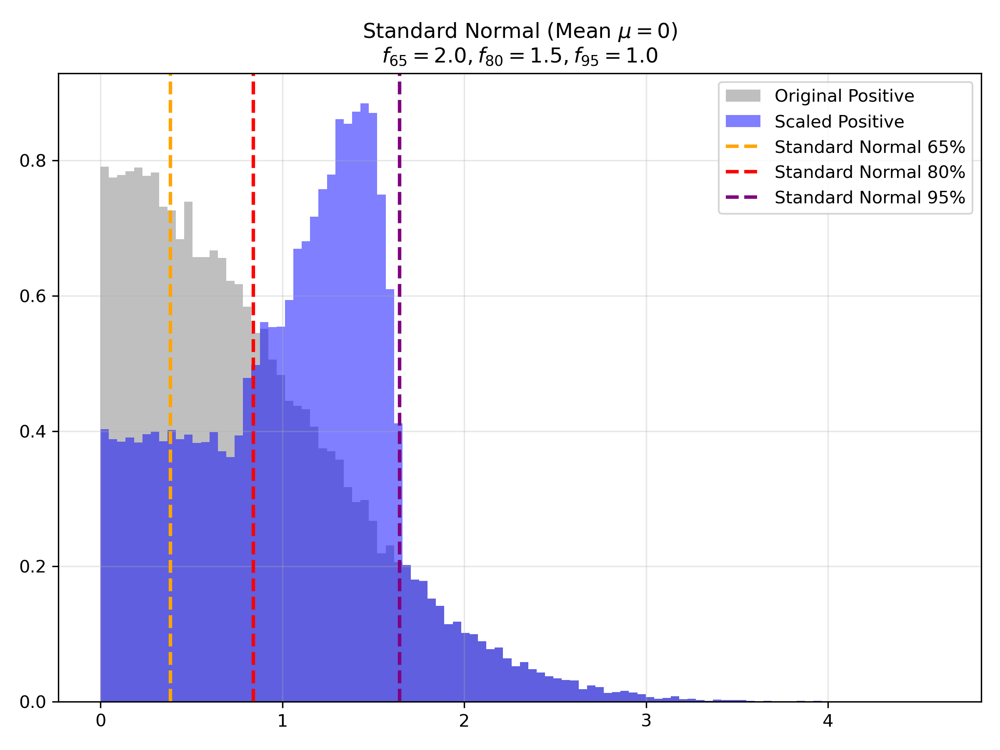
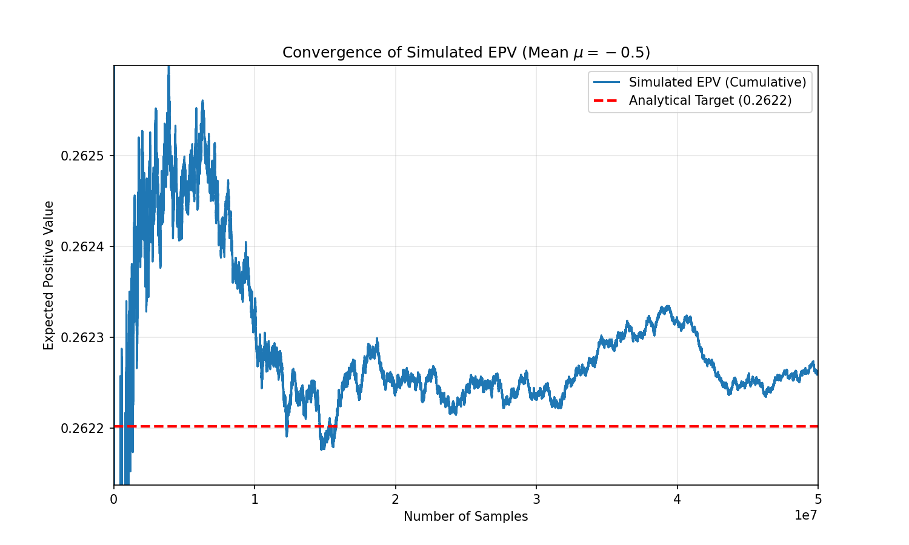

Here is the complete methodology document. You can save the content below as a `.md` file (e.g., `ScaleFactorMethodology.md`) to view it in any Markdown editor or render it to PDF/HTML.

***

# Methodology: Derivation of Equivalent Single Scale Factor

## 1. Problem Definition

We wish to correct a probability distribution $X$ (assumed to be Standard Normal, $X \sim \mathcal{N}(0, 1)$) using a set of estimated scale factors applied to specific percentile regions.

We have three estimated scale factors corresponding to specific quantiles:
*   $f_{65}$ for the 65% quantile.
*   $f_{80}$ for the 80% quantile.
*   $f_{95}$ for the 95% quantile.

The scaling function $S(u)$ (where $u$ is the cumulative probability) is defined piecewise:
1.  **$0.50 < u \le 0.65$**: Constant factor $f_{65}$.
2.  **$0.65 < u \le 0.80$**: Linear interpolation between $f_{65}$ and $f_{80}$.
3.  **$0.80 < u \le 0.95$**: Linear interpolation between $f_{80}$ and $f_{95}$.
4.  **$0.95 < u \le 1.00$**: Constant factor $f_{95}$.


*Figure 1: Visualization of the piecewise interpolation function $S(u)$ in percentage space. The function transitions from $f_{65}$ to $f_{80}$ and then to $f_{95}$ using linear interpolation, providing a smooth scaling factor across the probability distribution.*

**Objective:** Find a single constant scale factor $f$ such that the **Expected Positive Value (EPV)** of the distribution scaled by $f$ equals the EPV of the distribution scaled by the piecewise function $S(u)$.

$$ f \cdot E[\max(0, X)] = E[\max(0, X \cdot S(U))] $$

---

## 2. Mathematical Derivation (Value Space)

We express the Expected Positive Value (EPV) with scaling in value space ($x$) rather than probability space ($u$). This formulation is often more intuitive as it deals directly with the random variable $X$.

### 2.1 Formulation
The Expected Positive Value with scaling is:
$$ E = \int_{0}^{\infty} S(\Phi(x)) \cdot x \cdot \phi(x) \, dx $$

Using the substitution $u = \Phi(x)$, the linear interpolation $S(u) = A + B \cdot u$ becomes $S(\Phi(x)) = A + B \cdot \Phi(x)$.
Thus, the integrals we need to evaluate are:
1.  **Base Term**: $\int x \phi(x) dx$
2.  **Weighted Term**: $\int \Phi(x) x \phi(x) dx$

### 2.2 Analytical Integrals
From Appendix A, we know the antiderivatives:
1.  $\int x \phi(x) dx = -\phi(x)$
2.  $\int \Phi(x) x \phi(x) dx = -\Phi(x)\phi(x) + \frac{1}{2\sqrt{\pi}} \Phi(x\sqrt{2})$

### 2.3 Calculation of Weights
We define the boundaries in $x$-space corresponding to the $u$-quantiles:
*   $x_{50} = \Phi^{-1}(0.50) = 0$
*   $x_{65} = \Phi^{-1}(0.65) \approx 0.385$
*   $x_{80} = \Phi^{-1}(0.80) \approx 0.842$
*   $x_{95} = \Phi^{-1}(0.95) \approx 1.645$
*   $x_{100} = \infty$

The total denominator is $D = \int_{0}^{\infty} x \phi(x) dx = \phi(0) \approx 0.3989$.

#### Weight for $f_{65}$
*   **Region 1 ($0 \to x_{65}$)**: Constant $f_{65}$.
    $$ \text{Term}_1 = \int_{0}^{x_{65}} x \phi(x) dx = [-\phi(x)]_{0}^{x_{65}} = \phi(0) - \phi(x_{65}) \approx 0.02854 $$
*   **Region 2 ($x_{65} \to x_{80}$)**: Fading $f_{65} \cdot \frac{0.80 - \Phi(x)}{0.15}$.
    $$ \text{Term}_2 = \frac{1}{0.15} \left( 0.80 \int_{x_{65}}^{x_{80}} x \phi(x) dx - \int_{x_{65}}^{x_{80}} \Phi(x) x \phi(x) dx \right) \approx 0.03955 $$

#### Weight for $f_{80}$
*   **Region 2 ($x_{65} \to x_{80}$)**: Rising $f_{80} \cdot \frac{\Phi(x) - 0.65}{0.15}$.
    $$ \text{Term}_3 = \frac{1}{0.15} \left( \int_{x_{65}}^{x_{80}} \Phi(x) x \phi(x) dx - 0.65 \int_{x_{65}}^{x_{80}} x \phi(x) dx \right) \approx 0.05089 $$
*   **Region 3 ($x_{80} \to x_{95}$)**: Fading $f_{80} \cdot \frac{0.95 - \Phi(x)}{0.15}$.
    $$ \text{Term}_4 = \frac{1}{0.15} \left( 0.95 \int_{x_{80}}^{x_{95}} x \phi(x) dx - \int_{x_{80}}^{x_{95}} \Phi(x) x \phi(x) dx \right) \approx 0.07879 $$

#### Weight for $f_{95}$
*   **Region 3 ($x_{80} \to x_{95}$)**: Rising $f_{95} \cdot \frac{\Phi(x) - 0.80}{0.15}$.
    $$ \text{Term}_5 = \frac{1}{0.15} \left( \int_{x_{80}}^{x_{95}} \Phi(x) x \phi(x) dx - 0.80 \int_{x_{80}}^{x_{95}} x \phi(x) dx \right) \approx 0.09804 $$
*   **Region 4 ($x_{95} \to \infty$)**: Constant $f_{95}$.
    $$ \text{Term}_6 = \int_{x_{95}}^{\infty} x \phi(x) dx = [-\phi(x)]_{x_{95}}^{\infty} = \phi(x_{95}) \approx 0.10314 $$

### 2.4 Coefficient Aggregation
Summing the terms by factor:
*   $\Omega_{65} = \text{Term}_1 + \text{Term}_2 \approx 0.06809$
*   $\Omega_{80} = \text{Term}_3 + \text{Term}_4 \approx 0.12967$
*   $\Omega_{95} = \text{Term}_5 + \text{Term}_6 \approx 0.20118$

The weights $w_k = \frac{\Omega_k}{D}$ match the numerical values found in Section 3.

---

## 3. Final Analytical Solution

Dividing the components $\Omega$ by the denominator $D$ yields the normalized weights $w$.

$$ f = w_{65} f_{65} + w_{80} f_{80} + w_{95} f_{95} $$

Where $w_k = \frac{\Omega_k}{D}$.

### 3.1 Numerical Values for Normal Distribution
Computing the integrals numerically for a standard Normal distribution yields the following weights:


*Figure 2: Effect of scaling on the standard normal distribution ($\mu=0$). Vertical dashed lines indicate the 65%, 80%, and 95% quantiles.*

| Factor | Weight ($w$) | Description |
| :--- | :--- | :--- |
| **$f_{65}$** | **17.07%** | Dominates the body (0.50-0.65), fades in tail. |
| **$f_{80}$** | **32.50%** | Bridges the body and the extreme tail. |
| **$f_{95}$** | **50.43%** | Dominates the extreme tail (>0.95) where values are largest. |
| **Total** | **100.00%** | |

### 3.2 The Final Equation

$$ f \approx 0.1707 \cdot f_{65} + 0.3250 \cdot f_{80} + 0.5043 \cdot f_{95} $$

*Note: Even though the 95%+ region covers only 5% of the probability space, it accounts for over 50% of the scaling weight. This is due to the convexity of the distribution tail—the values in the extreme tail are significantly larger than those near the median, contributing more to the Expected Positive Value.*

---

---

## 4. Interpretation of Weights

Why does $f_{95}$ carry the highest weight (~54%) despite covering only the top 5% of the probability space? This is due to the **magnitude of the values in the tail**.

### 4.1 Weighting by "Value", not just Probability
The goal is to match the **Expected Positive Value (EPV)**. The EPV is a sum of (Probability $\times$ Magnitude).
*   **Near the median (50-65%)**: The probability mass is large (15% width), but the values of a standard normal distribution are small (close to 0).
*   **In the tail (>95%)**: The probability mass is small (5% width), but the values are **very large** (> 1.65).

### 4.2 The "Leverage" of the Tail
Because the standard normal distribution is convex in the tail, the extreme values contribute disproportionately to the total expected value.
*   **$f_{65}$** applies to the "body" of the distribution where values are small.
*   **$f_{95}$** applies to the "extreme tail" where the values are largest.

### Summary Table
 
 | Region | Probability Width | Typical Value Magnitude | Contribution to Total Value |
 | :--- | :--- | :--- | :--- |
 | **50% - 65%** | **15%** (Large) | **Low** (~0.0 to 0.4) | Small (~17% weight) |
 | **95% - 100%** | **5%** (Small) | **High** (> 1.65) | **Huge (~50% weight)** |
 
 Thus, $f_{95}$ is the most critical factor because it scales the part of the distribution that contributes the most to the final expected positive value.

---

## 5. Extension to Non-Zero Mean Distributions

The methodology can be extended to cases where the underlying distribution $X \sim \mathcal{N}(\mu, 1)$ has a non-zero mean.

### 5.1 Methodology Adjustment
The logic remains the same, but the integration limits shift because the scale factors are defined on the percentiles of $X$.
*   $u = \Phi_{\mu}(x)$ (CDF of the shifted normal).
*   The "Positive Value" domain is still $x > 0$, but this now corresponds to $u > \Phi_{\mu}(0)$.
*   For the portion of the body $u \le 0.65$ that is positive (i.e., between $u_{zero}$ and $0.65$), we assume the scale factor $f_{65}$ applies.

### 5.2 Coefficients
The resulting weights for $\mu = 0.5$ and $\mu = -0.5$ are:

| Mean ($\mu$) | $w_{65}$ | $w_{80}$ | $w_{95}$ | Formulation |
| :--- | :--- | :--- | :--- | :--- |
| **0.0** | **17.07%** | **32.50%** | **50.43%** | Reference |
| **0.5** | **32.88%** | **29.33%** | **37.79%** | More weight on body ($f_{65}$), as more of the body is positive. |
| **-0.5** | **2.14%** | **27.75%** | **70.11%** | Dominant tail ($f_{95}$), as the body is mostly negative/zero. |


*Figure 3: Effect of scaling on distributions with non-zero means. Vertical dashed lines indicate the 65%, 80%, and 95% quantiles of the underlying distribution.*

### 5.3 Numerical Verification
We verified these coefficients using Monte Carlo simulations ($N=1,000,000$).

**Case $\mu = 0.5$:**
*   Analytical Factor: $f \approx 1.296$
*   Simulated vs Analytical Difference: $0.04\%$


**Case $\mu = -0.5$:**
*   Analytical Factor: $f \approx 1.326$
*   Simulated vs Analytical Difference: $-0.10\%$


---

## Appendix A: Analytical Evaluation of Integrals

The weights $\Omega_k$ involve integrals of the form $\int \Phi^{-1}(u) du$ and $\int u \Phi^{-1}(u) du$. These can be evaluated analytically using integration by substitution and integration by parts.

Let $x = \Phi^{-1}(u)$, which implies $u = \Phi(x)$ and $du = \phi(x) dx$.

### A.1 Integral of Quantile Function
$$ I_1 = \int \Phi^{-1}(u) du $$
Substitute $u = \Phi(x)$:
$$ I_1 = \int x \phi(x) dx $$
Since $\phi'(x) = -x \phi(x)$, we have:
$$ I_1 = -\phi(x) + C = -\phi(\Phi^{-1}(u)) + C $$

### A.2 Integral of Weighted Quantile Function
$$ I_2 = \int u \Phi^{-1}(u) du $$
Substitute $u = \Phi(x)$:
$$ I_2 = \int \Phi(x) x \phi(x) dx $$
Use integration by parts with $U = \Phi(x)$ and $dV = x \phi(x) dx$.
Then $dU = \phi(x) dx$ and $V = -\phi(x)$.
$$ \int \Phi(x) x \phi(x) dx = -\Phi(x)\phi(x) - \int (-\phi(x)) \phi(x) dx $$
$$ = -\Phi(x)\phi(x) + \int \phi(x)^2 dx $$
The term $\int \phi(x)^2 dx$ involves the integral of the square of the Gaussian PDF, which relates to the CDF of a normal distribution with variance $1/2$.
$$ \int \phi(x)^2 dx = \frac{1}{2\sqrt{\pi}} \Phi(x\sqrt{2}) $$
Thus:
$$ I_2 = -u \phi(\Phi^{-1}(u)) + \frac{1}{2\sqrt{\pi}} \Phi(\Phi^{-1}(u)\sqrt{2}) + C $$

---

## Appendix B: Python Implementation

You can verify the weights using the following Python script.

```python
import numpy as np
import matplotlib.pyplot as plt
from scipy.stats import norm
from scipy.integrate import quad

def calculate_analytical_weights(mu=0):
    """
    Calculates weights for N(mu, 1) assuming scale factors are applied 
    based on percentiles of the *underlying distribution* N(mu, 1).
    """
    # Distribution
    dist = norm(loc=mu, scale=1)
    
    # Denominator: Expected Positive Value of X ~ N(mu, 1)
    # E[max(0, X)] = int_0^inf x * phi(x-mu) dx
    # Let's compute this numerically to be safe for any mu
    def integrand_denom(x):
        return x * dist.pdf(x)
    E_total, _ = quad(integrand_denom, 0, np.inf)

    # Helper: Quantile Function based on Percentiles of N(mu, 1)
    # The scale factor S(u) depends on the *percentile* u.
    # We want to integrate S(u) * Q(u) du from u_start to 1.
    # Where Q(u) is the quantile function of N(mu, 1).
    # Since we are interested in Positive Value, we only integrate where Q(u) > 0.
    # For mu=0, Q(0.5)=0, so we integrate 0.5 to 1.
    # For mu != 0, Q(u)=0 happens at u_zero = CDF(0).
    # so we integrate from u_zero to 1.
    
    u_zero = dist.cdf(0)
    
    q = dist.ppf

    # Helper: Linear Interpolation Integrand
    def integrand(u, u_start, width, weight_type):
        factor = (u - u_start) / width if weight_type == 'rising' else ((u_start + width) - u) / width
        return factor * q(u)
    
    # Integration limits are intersection of [u_zero, 1] and the regions defined by 0.65, 0.80, 0.95
    # Region 1: effectively u_zero -> 0.65
    # We extend f65 to cover all positive values below the 65th percentile
    r1_start = u_zero
    r1_end = 0.65
    
    # Omega 65
    o65 = 0
    if r1_end > r1_start:
         val, _ = quad(q, r1_start, r1_end)
         o65 += val
         
    # Region 2: 0.65 -> 0.80
    r2_start = max(u_zero, 0.65)
    r2_end = 0.80
    
    # Contribution to f65 (Falling)
    if r2_end > r2_start:
        val, _ = quad(integrand, r2_start, r2_end, args=(0.65, 0.15, 'falling'))
        o65 += val
        
    w_65 = o65 / E_total
    
    # Omega 80
    o80 = 0
    # Region 2 (Rising)
    if r2_end > r2_start:
        val, _ = quad(integrand, r2_start, r2_end, args=(0.65, 0.15, 'rising'))
        o80 += val
        
    # Region 3: 0.80 -> 0.95
    r3_start = max(u_zero, 0.80)
    r3_end = 0.95
    
    # Contribution to f80 (Falling)
    if r3_end > r3_start:
        val, _ = quad(integrand, r3_start, r3_end, args=(0.80, 0.15, 'falling'))
        o80 += val
        
    w_80 = o80 / E_total
    
    # Omega 95
    o95 = 0
    # Region 3 (Rising)
    if r3_end > r3_start:
        val, _ = quad(integrand, r3_start, r3_end, args=(0.80, 0.15, 'rising'))
        o95 += val
        
    # Region 4: 0.95 -> 1.00
    r4_start = max(u_zero, 0.95)
    r4_end = 1.00
    
    if r4_end > r4_start:
        val, _ = quad(q, r4_start, r4_end)
        o95 += val
        
    w_95 = o95 / E_total

    return w_65, w_80, w_95

if __name__ == "__main__":
    means = [0, 0.5, -0.5]
    for mu in means:
        w65, w80, w95 = calculate_analytical_weights(mu)
        print(f"Mean {mu}:")
        print(f"  w_65: {w65:.4%}")
        print(f"  w_80: {w80:.4%}")
        print(f"  w_95: {w95:.4%}")
        print(f"  Sum:  {w65+w80+w95:.4%}\\n")
```

---

## Appendix C: Original Derivation in Probability Space ($u$)

For completeness, we include the original derivation performed in probability space using quantiles.

Let $\phi(x)$ be the standard normal PDF and $\Phi^{-1}(u)$ be the inverse CDF (quantile function). Since $X$ has a zero mean, the positive part of the distribution corresponds to percentiles $u \in [0.5, 1.0]$.

The equivalence equation is:

$$ f \int_{0.5}^{1} \Phi^{-1}(u) \, du = \int_{0.5}^{1} S(u) \cdot \Phi^{-1}(u) \, du $$

### C.1 The Denominator (Base Value)
$$ D = \int_{0.5}^{1} \Phi^{-1}(u) \, du = \phi(0) = \frac{1}{\sqrt{2\pi}} \approx 0.39894 $$

### C.2 The Numerator (Weighted Contributions)
To find the contribution of each factor ($f_{65}, f_{80}, f_{95}$), we rearrange the interpolation terms in Regions 2 and 3.

**In Region 2:**
$$ S(u) = f_{65} \underbrace{\left( \frac{0.80 - u}{0.15} \right)}_{\text{Fading } f_{65}} + f_{80} \underbrace{\left( \frac{u - 0.65}{0.15} \right)}_{\text{Rising } f_{80}} $$

**In Region 3:**
$$ S(u) = f_{80} \underbrace{\left( \frac{0.95 - u}{0.15} \right)}_{\text{Fading } f_{80}} + f_{95} \underbrace{\left( \frac{u - 0.80}{0.15} \right)}_{\text{Rising } f_{95}} $$

Now, we group the integrals by factor:

**Weight for $f_{65}$**
$$ \Omega_{65} = \underbrace{\int_{0.50}^{0.65} \Phi^{-1}(u)du}_{\text{Region 1 (Full)}} + \underbrace{\int_{0.65}^{0.80} \left( \frac{0.80 - u}{0.15} \right) \Phi^{-1}(u)du}_{\text{Region 2 (Fading)}} $$

**Weight for $f_{80}$**
$$ \Omega_{80} = \underbrace{\int_{0.65}^{0.80} \left( \frac{u - 0.65}{0.15} \right) \Phi^{-1}(u)du}_{\text{Region 2 (Rising)}} + \underbrace{\int_{0.80}^{0.95} \left( \frac{0.95 - u}{0.15} \right) \Phi^{-1}(u)du}_{\text{Region 3 (Fading)}} $$

**Weight for $f_{95}$**
$$ \Omega_{95} = \underbrace{\int_{0.80}^{0.95} \left( \frac{u - 0.80}{0.15} \right) \Phi^{-1}(u)du}_{\text{Region 3 (Rising)}} + \underbrace{\int_{0.95}^{1.00} \Phi^{-1}(u)du}_{\text{Region 4 (Full)}} $$

These integrals yield the same results as the value-space derivation.
