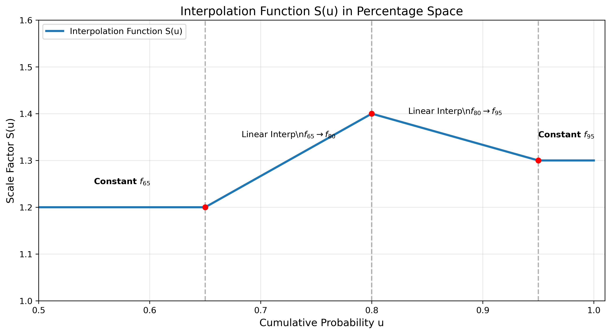

Here is the complete methodology document. You can save the content below as a `.md` file (e.g., `ScaleFactorMethodology.md`) to view it in any Markdown editor or render it to PDF/HTML.

***

# Methodology: Derivation of Equivalent Single Scale Factor

## 1. Problem Definition

We wish to correct a probability distribution $X$ (assumed to be Standard Normal, $X \sim \mathcal{N}(0, 1)$) using a set of estimated scale factors applied to specific percentile regions.

We have three estimated scale factors corresponding to specific quantiles:
*   $f_{65}$ for the 65% quantile.
*   $f_{80}$ for the 80% quantile.
*   $f_{95}$ for the 95% quantile.

The scaling function $S(u)$ (where $u$ is the cumulative probability) is defined piecewise:
1.  **$0.50 < u \le 0.65$**: Constant factor $f_{65}$.
2.  **$0.65 < u \le 0.80$**: Linear interpolation between $f_{65}$ and $f_{80}$.
3.  **$0.80 < u \le 0.95$**: Linear interpolation between $f_{80}$ and $f_{95}$.
4.  **$0.95 < u \le 1.00$**: Constant factor $f_{95}$.


*Figure 1: Visualization of the piecewise interpolation function $S(u)$ in percentage space. The function transitions from $f_{65}$ to $f_{80}$ and then to $f_{95}$ using linear interpolation, providing a smooth scaling factor across the probability distribution.*

**Objective:** Find a single constant scale factor $f$ such that the **Expected Positive Value (EPV)** of the distribution scaled by $f$ equals the EPV of the distribution scaled by the piecewise function $S(u)$.

$$ f \cdot E[\max(0, X)] = E[\max(0, X \cdot S(U))] $$

---

## 2. Mathematical Derivation

Let $\phi(x)$ be the standard normal PDF and $\Phi^{-1}(u)$ be the inverse CDF (quantile function). Since $X$ has a zero mean, the positive part of the distribution corresponds to percentiles $u \in [0.5, 1.0]$.

The equivalence equation is:

$$ f \int_{0.5}^{1} \Phi^{-1}(u) \, du = \int_{0.5}^{1} S(u) \cdot \Phi^{-1}(u) \, du $$

Solving for $f$:

$$ f = \frac{\int_{0.5}^{1} S(u) \Phi^{-1}(u) \, du}{\int_{0.5}^{1} \Phi^{-1}(u) \, du} $$

### 2.1 The Denominator (Base Value)

The denominator is the expected value of the positive tail of a standard normal distribution.
$$ D = \int_{0.5}^{1} \Phi^{-1}(u) \, du = \phi(0) = \frac{1}{\sqrt{2\pi}} \approx 0.39894 $$

### 2.2 The Numerator (Weighted Contributions)

The piecewise function $S(u)$ can be decomposed into contributions attached to each specific factor ($f_{65}, f_{80}, f_{95}$). Because the interpolation is linear in probability space $u$, we can rearrange the numerator into a weighted sum form:

$$ \text{Numerator} = f_{65} \cdot \Omega_{65} + f_{80} \cdot \Omega_{80} + f_{95} \cdot \Omega_{95} $$

Where $\Omega_k$ represents the integral of the probability mass influenced by that specific factor.

#### Weight for $f_{65}$
$f_{65}$ applies fully from 0.50 to 0.65, and fades linearly from 1 to 0 between 0.65 and 0.80.
$$ \Omega_{65} = \underbrace{\int_{0.50}^{0.65} \Phi^{-1}(u)du}_{\text{Full}} + \underbrace{\int_{0.65}^{0.80} \left( \frac{0.80 - u}{0.15} \right) \Phi^{-1}(u)du}_{\text{Fading}} $$

#### Weight for $f_{80}$
$f_{80}$ rises linearly from 0 to 1 between 0.65 and 0.80, and fades linearly from 1 to 0 between 0.80 and 0.95.
$$ \Omega_{80} = \underbrace{\int_{0.65}^{0.80} \left( \frac{u - 0.65}{0.15} \right) \Phi^{-1}(u)du}_{\text{Rising}} + \underbrace{\int_{0.80}^{0.95} \left( \frac{0.95 - u}{0.15} \right) \Phi^{-1}(u)du}_{\text{Fading}} $$

#### Weight for $f_{95}$
$f_{95}$ rises linearly from 0 to 1 between 0.80 and 0.95, and applies fully from 0.95 to 1.00.
$$ \Omega_{95} = \underbrace{\int_{0.80}^{0.95} \left( \frac{u - 0.80}{0.15} \right) \Phi^{-1}(u)du}_{\text{Rising}} + \underbrace{\int_{0.95}^{1.00} \Phi^{-1}(u)du}_{\text{Full}} $$

---

## 3. Final Analytical Solution

Dividing the components $\Omega$ by the denominator $D$ yields the normalized weights $w$.

$$ f = w_{65} f_{65} + w_{80} f_{80} + w_{95} f_{95} $$

Where $w_k = \frac{\Omega_k}{D}$.

### 3.1 Numerical Values for Normal Distribution
Computing the integrals numerically for a standard Normal distribution yields the following weights:

| Factor | Weight ($w$) | Description |
| :--- | :--- | :--- |
| **$f_{65}$** | **15.58%** | Dominates the body (0.50-0.65), fades in tail. |
| **$f_{80}$** | **30.60%** | Bridges the body and the extreme tail. |
| **$f_{95}$** | **53.82%** | Dominates the extreme tail (>0.95) where values are largest. |
| **Total** | **100.00%** | |

### 3.2 The Final Equation

$$ f \approx 0.1558 \cdot f_{65} + 0.3060 \cdot f_{80} + 0.5382 \cdot f_{95} $$

*Note: Even though the 95%+ region covers only 5% of the probability space, it accounts for nearly 54% of the scaling weight. This is due to the convexity of the distribution tail—the values in the extreme tail are significantly larger than those near the median, contributing more to the Expected Positive Value.*

---

## Appendix: Python Implementation

You can verify the weights using the following Python script.

```python
import numpy as np
from scipy.stats import norm
from scipy.integrate import quad

def calculate_weights():
    # Denominator: Base Expected Positive Value
    # Integral of Quantile from 0.5 to 1.0 is exactly norm.pdf(0)
    E_total = norm.pdf(0)

    # Helper: Quantile Function
    q = norm.ppf

    # Helper: Linear Interpolation Integrand
    # weight_type: 'rising' (0->1) or 'falling' (1->0)
    def integrand(u, u_start, width, weight_type):
        factor = (u - u_start) / width if weight_type == 'rising' else ((u_start + width) - u) / width
        return factor * q(u)

    # --- Omega 65 ---
    # 1. Constant 0.50 to 0.65
    o65_1, _ = quad(q, 0.50, 0.65)
    # 2. Falling 0.65 to 0.80
    o65_2, _ = quad(integrand, 0.65, 0.80, args=(0.65, 0.15, 'falling'))
    w_65 = (o65_1 + o65_2) / E_total

    # --- Omega 80 ---
    # 1. Rising 0.65 to 0.80
    o80_1, _ = quad(integrand, 0.65, 0.80, args=(0.65, 0.15, 'rising'))
    # 2. Falling 0.80 to 0.95
    o80_2, _ = quad(integrand, 0.80, 0.95, args=(0.80, 0.15, 'falling'))
    w_80 = (o80_1 + o80_2) / E_total

    # --- Omega 95 ---
    # 1. Rising 0.80 to 0.95
    o95_1, _ = quad(integrand, 0.80, 0.95, args=(0.80, 0.15, 'rising'))
    # 2. Constant 0.95 to 1.00
    o95_2, _ = quad(q, 0.95, 1.00)
    w_95 = (o95_1 + o95_2) / E_total

    return w_65, w_80, w_95

if __name__ == "__main__":
    w65, w80, w95 = calculate_weights()
    print(f"Weights:\nfw_65: {w65:.4%}\nfw_80: {w80:.4%}\nfw_95: {w95:.4%}")
```

---

## 4. Interpretation of Weights

Why does $f_{95}$ carry the highest weight (~54%) despite covering only the top 5% of the probability space? This is due to the **magnitude of the values in the tail**.

### 4.1 Weighting by "Value", not just Probability
The goal is to match the **Expected Positive Value (EPV)**. The EPV is a sum of (Probability $\times$ Magnitude).
*   **Near the median (50-65%)**: The probability mass is large (15% width), but the values of a standard normal distribution are small (close to 0).
*   **In the tail (>95%)**: The probability mass is small (5% width), but the values are **very large** (> 1.65).

### 4.2 The "Leverage" of the Tail
Because the standard normal distribution is convex in the tail, the extreme values contribute disproportionately to the total expected value.
*   **$f_{65}$** applies to the "body" of the distribution where values are small.
*   **$f_{95}$** applies to the "extreme tail" where the values are largest.

### Summary Table

| Region | Probability Width | Typical Value Magnitude | Contribution to Total Value |
| :--- | :--- | :--- | :--- |
| **50% - 65%** | **15%** (Large) | **Low** (~0.0 to 0.4) | Small (~16% weight) |
| **95% - 100%** | **5%** (Small) | **High** (> 1.65) | **Huge (~54% weight)** |

Thus, $f_{95}$ is the most critical factor because it scales the part of the distribution that contributes the most to the final expected positive value.